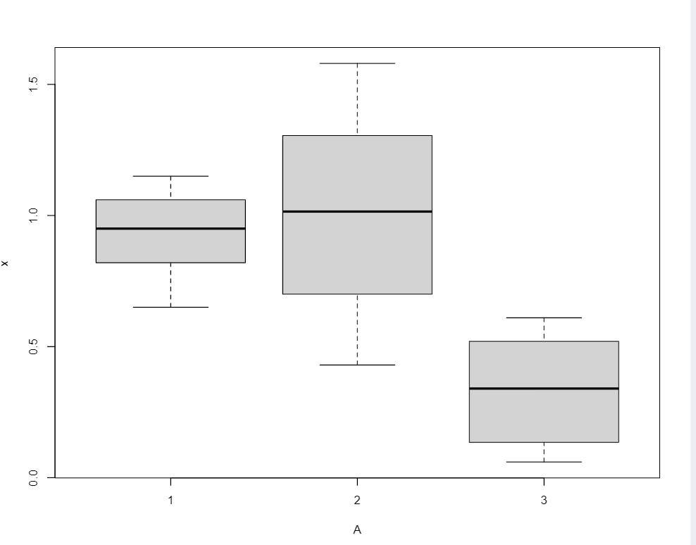

# Mathmodeling # HW2

1.

```python
solvent <- data.frame(
    x = c(
        1.06, 0.79, 0.82, 0.89, 1.05, 0.95, 0.65,
        1.15, 1.12, 1.58, 1.45,
        0.57, 1.16, 1.12, 0.91,
        0.83, 0.43, 0.29,
        0.06, 0.44, 0.61, 0.55, 0.43, 0.51, 0.10,
        0.34, 0.53, 0.06, 0.09, 0.17, 0.60, 0.17
    ),
    A = factor(rep(1:3, c(9, 8, 15)))
)
attach(solvent)
print(tapply(x, A, mean))
print(pairwise.t.test(x, A))
plot(x~A)
```

**data:  x and A**

|      |     1 |  2|
| ---- | ---- | ---- |
|    2  |  0.62| - |
|   3   | 9.8e-06 |5.5e-06|

**P value adjustment method: holm**



**所以芬芳剂于氯烷吸附率无较大差异,儿酯类与两者吸附率差异大**

2.                            
(1)
```python
person <- data.frame(
    X = c(
        62, 60, 60, 25, 24, 23, 20, 13, 12, 6,
        62, 62, 24, 24, 22, 20, 19, 10, 8, 8,
        37, 31, 15, 15, 14, 14, 14, 5, 3, 2
    ),
    A = factor(rep(1:3, c(10, 10, 10)))

)
print(kruskal.test(X ~ A, data = person))
```

**_Kruskal-Wallis_** rank sum test
data:  X by A
Kruskal-Wallis chi-squared = 3.2535, df = 2, p-value = 0.1966
**_Kruskal-Wallis_** 秩和检验的$ P = 0.1966< 0.05$,说明平均测试分数无明显差异
(2)
```python
x <- c(62, 60, 60, 25, 24, 23, 20, 13, 12, 6)
y <- c(62, 62, 24, 24, 22, 20, 19, 10, 8, 8)
z <- c(37, 31, 15, 15, 14, 14, 14, 5, 3, 2)
print(shapiro.test(x))
print(shapiro.test(y))
print(shapiro.test((z)))
```

Shapiro-Wilk normality test
data:  x
W = 0.81494,$ p-value = 0.02201 <0.05$

Shapiro-Wilk normality test
data:  y
W = 0.76284, $p-value = 0.005115<0.05$

Shapiro-Wilk normality test
data:  (z)
W = 0.86148, $p-value = 0.07944>0.05$
所以前两组数据不满足正态分布要求

```python
person <- data.frame(
    X = c(
        62, 60, 60, 25, 24, 23, 20, 13, 12, 6,
        62, 62, 24, 24, 22, 20, 19, 10, 8, 8,
        37, 31, 15, 15, 14, 14, 14, 5, 3, 2
    ),
    A = factor(rep(1:3, c(10, 10, 10)))
)

print(bartlett.test(X ~ A, data = person))
```
Bartlett test of homogeneity of variances
data:  X by A
$Bartlett's \,K-squared = 3.6228, df = 2, p-value = 0.1634>0.05$
所以方差是齐性的
综上所述,三组数据满足方差齐性,但不满足正态分布要求,所以需要用到$Kruskal-Wallis$秩和检验
3.
```python
library(MASS)
train <- matrix(
    c(
        1.24, 1.36, 1.38, 1.38, 1.38, 1.40, 1.48, 1.54, 1.56,
        1.14, 1.18, 1.20, 1.26, 1.28, 1.30,
        1.27, 1.74, 1.64, 1.82, 1.90, 1.70, 1.82, 1.82, 2.08,
        1.78, 1.96, 1.86, 2.00, 2.00, 1.96
    ),
    ncol = 2
)
sp <- factor(rep(1:2, c(9, 6)), labels = c("Af", "Apf"))
tst <- c(1.24, 1.80)
lda_sol <- lda(train, sp)
print(predict(lda_sol, tst)$class)
print(table(sp, predict(lda_sol)$class))
qda_sol <- qda(train, sp)
print(table(sp, predict(qda_sol)$class))
```
经检验,对三种给定的蠓虫,两种方法计算的结果都为:

lda:
|  sp    |   Af    |  Apf    |
| ---- | ---- | ---- |
|  Af    | 9     | 0     |
|  Apf    |    0  |   6   |

qda;
|  sp    |   Af    |  Apf    |
| ---- | ---- | ---- |
|  Af    | 9     | 0     |
|  Apf    |    0  |   6   |

$两种方法回代正确率100\%,因此两者都可靠$

